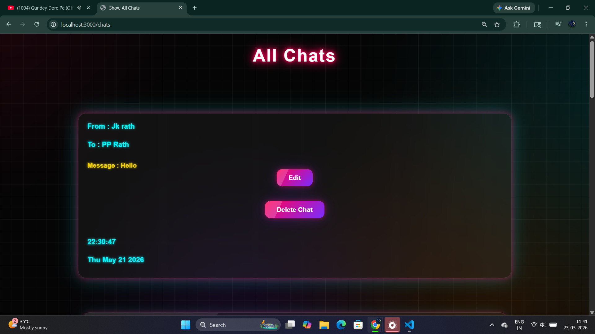
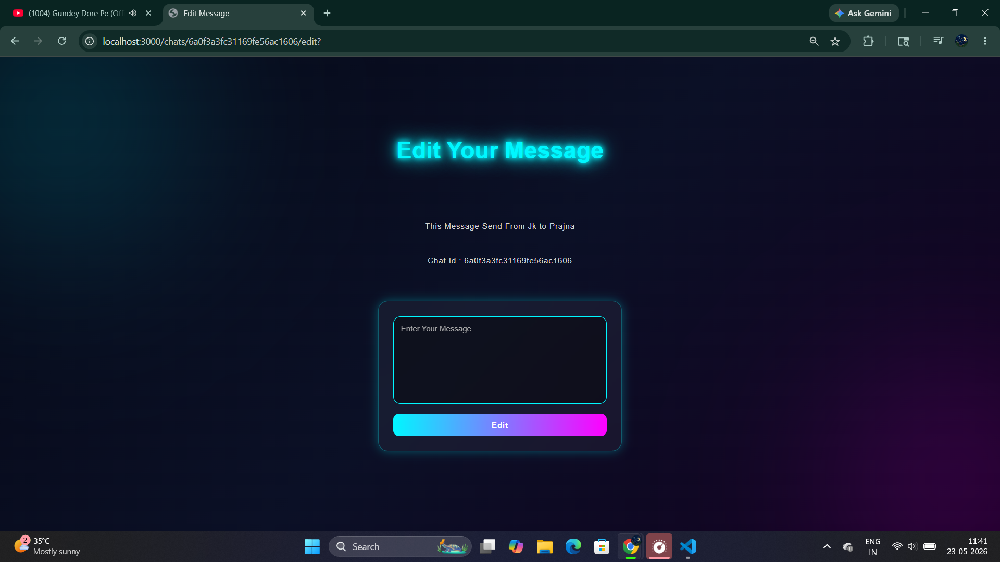
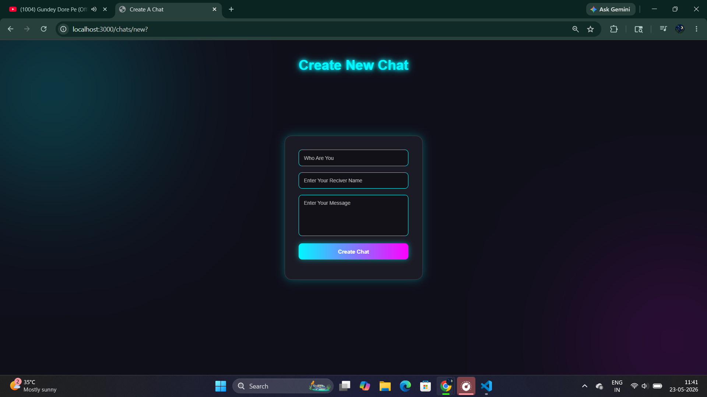

# ChatSphere 🚀

ChatSphere is a robust, full-stack chat log management application built using the MVC architecture. Driven entirely by Node.js, Express, and MongoDB on the backend, the application renders dynamic views using EJS (Embedded JavaScript templates). The entire interface features a premium dark-themed aesthetic, custom CSS neon glows, and glassmorphism containers.

---

## ✨ Features

* **Full CRUD Implementation:** Create, Read, Update, and Delete chat logs dynamically with seamless server-side processing.
* **Server-Side Templating:** Dynamic rendering of views and data routing using EJS templates.
* **Premium Neon UI:** Modern dark-mode design enhanced with cyan and magenta neon glows, ambient backdrops, and custom CSS styling.
* **Method Override Routing:** Robust handling of standard HTTP methods (`POST`, `GET`) along with `PUT` and `DELETE` requests for clean routing.
* **Automated Timestamps:** Logs exact server-side generated date and time stamps for every chat message.

---

## 🛠️ Tech Stack

* **Backend Environment:** Node.js
* **Web Framework:** Express.js
* **Database:** MongoDB (via Mongoose ODM)
* **View Engine / Templating:** EJS (Embedded JavaScript)
* **Styling:** Custom CSS3 (Glassmorphism & Neon Glow Keyframes)
* **Middleware:** Method-Override, Express.urlencoded

---

## 📸 Interface Preview

### 📋 All Chats Dashboard
A complete bird's-eye view of your active chats inside premium glassmorphic cards with responsive action buttons.

---

### ✏️ Edit Message Screen
Dynamic edit view pulling individual message states securely by Chat ID for precise modifications.

---

### ➕ Create New Chat Screen
Sleek, minimalist interface for creating new logs with vibrant input border-glows.

---
